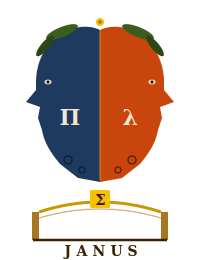

# Janus

<p align="center">
  
</p>

> *Un bridge bifronte sopra l'FFI Agda↔Haskell.*

Giano (Janus) ha due facce. Una guarda il mondo dei **tipi dipendenti** (Agda,
faccia Π): proprietà dimostrate, totalità, dati raffinati. L'altra guarda il
mondo degli **effetti** (Haskell, faccia λ): `IO`, parzialità, errori runtime.
Janus standardizza il confine fra i due, aggiungendo automazione
(bridge componibili) e sicurezza (validazione con testimone) sopra l'FFI grezzo.
La pietra di volta del ponte è `Σ`: il *witness* che `Refine` produce —
il dato raffinato impacchettato con la sua prova.

## Moduli

- `Janus/Transport.agda` — **Strato 1**: trasporto totale type-safe.
  Record `Transport A H` (encode/decode) + combinatori componibili
  `_⊗_` (prodotto), `_⊕_` (somma), `listT`, `_∘T_`, `idT`.
- `Janus/Coherence.agda` — la legge `decode ∘ encode ≡ id`, dimostrata
  **chiusa** per tutti i combinatori. È ciò che distingue Janus da un FFI grezzo.
- `Janus/Refine.agda` — **Strato 2**: `Refine A H` *contiene* un `Transport`
  e aggiunge un invariante `P` con `validate : (a : A) → Dec (P a)`.
  `decodeProof` restituisce `Maybe (Σ A P)`: il dato impacchettato con la prova.
- `Janus/FFI.agda` — la direzione Agda→Haskell: `IO` importato,
  `call` (solo trasporto) e `callChecked` (le due facce fuse).
- `Janus/FS*.agda` — un wrapper POSIX *PoC* costruito sopra il core. Vedrà
  vita propria come runtime di [IbisFS](#downstream); la sua presenza qui
  documenta il pattern "buccia impura" che ogni runtime esterno dovrà seguire.
- `Main.agda` / `MainFS.agda` — demo eseguibili.

## Compilare ed eseguire

Tutta la toolchain è nel flake (Agda 2.8 + stdlib 2.3 + GHC 9.10):

```bash
nix develop
agda --compile Main.agda
LC_ALL=C.UTF-8 ./Main
```

Output atteso:

```
Janus PoC — callChecked (due facce in una)
42
rifiutato: negativo
fine
```

## Convertire un tuo FFI esistente a Janus

Hai tipicamente un postulato così:

```agda
postulate rawFn : HsIn → IO HsOut
{-# COMPILE GHC rawFn = ... #-}
```

Tre passi:

1. **Tieni il postulato grezzo** invariato — è la "funzione Haskell grezza".
2. **Definisci i bridge.** Per i tipi già condivisi (Int, String, ...) usa
   `idT`. Per i tipi composti, componi: `ta ⊗ tb`, `listT ta`, ecc.
3. **Scegli il livello di garanzia al confine:**
   - solo trasporto type-safe → `call transportIn transportOut rawFn`
   - validazione con prova sul ritorno → `callChecked transportIn refineOut rawFn`
     (definisci `refineOut` con l'invariante `P` e un `validate` decidibile).

La conversione è **additiva**: parti tutto con `call`, e promuovi a
`callChecked` solo i confini dove un invariante conta, senza toccare il resto.

## Come libreria (per i consumer)

Il flake espone `lib.mkShell` per i consumer downstream. Nel tuo `flake.nix`:

```nix
inputs.janus.url = "github:avit-io/janus";   # o path:../janus in monorepo
inputs.janus.inputs.nixpkgs.follows = "nixpkgs";

devShells.x86_64-linux.default = inputs.janus.lib.mkShell {
  pkgs = nixpkgs.legacyPackages.x86_64-linux;
};
```

```
# tuo-progetto.agda-lib
name: mio-progetto
include: .
depend: standard-library janus
```

Output del flake:

| Output | Contenuto |
|---|---|
| `packages.lib` | la libreria Agda (`Janus/*.agda`) come derivazione Nix |
| `packages.default` | idem |
| `lib.mkShell` | devShell per i consumer con Agda + stdlib + janus + GHC |
| `devShells.default` | devShell per sviluppare janus stesso |

## Downstream

Janus è pensato come fondazione condivisa di due progetti paralleli:

- **[IbisFS](../ibisfs)** — un filesystem come *reticolo algebrico*, non
  come gerarchia. Il core algebrico è già chiuso (14 leggi dimostrate);
  Janus diventa il suo runtime POSIX quando IbisFS tocca il mondo reale.
- **Cloud bridges** (AWS / Azure) — i grossi SDK Haskell di `amazonka` e
  `azure-storage-*` esposti via Janus, con `Refine` per i vincoli di
  naming delle risorse e cattura tipata delle eccezioni. Non ancora iniziato.

L'idea di fondo: **un unico confine FFI disciplinato**, e ogni runtime
(filesystem, S3, Azure Blob) ne è un'istanza. Le leggi di `Coherent` non
si toccano.

## Roadmap

In ordine di valore, per arrivare a "Janus pronto per IbisFS e Cloud":

1. **`callChecked` simmetrico** — oggi valida solo il *ritorno*. Per gli
   SDK cloud ti servirà spesso validare anche l'*input* (i nomi di risorsa
   sono il caso ovvio: bucket names AWS, container names Azure).
2. **Direzione Haskell→Agda** — esporre prove ad Haskell via
   `{-# COMPILE GHC … as … #-}`. Necessaria per callback handler (lambda,
   webhook) che il chiamante Haskell vuole invocare passando dati validati.
3. **`ErrorTaxonomy` parametrizzabile** — oggi `Janus.FS` ha un
   `FileError` ad hoc. Standardizzare un record che IbisFS e i runtime
   cloud possano istanziare evita di reinventare la traduzione
   eccezione→dato ad ogni boundary.
4. **CI con `nix flake check`** — typecheck di `Janus/*.agda` come
   guard-rail di regressione. Banale, da fare prima del primo consumer
   downstream serio.

## Licenza

MIT.
